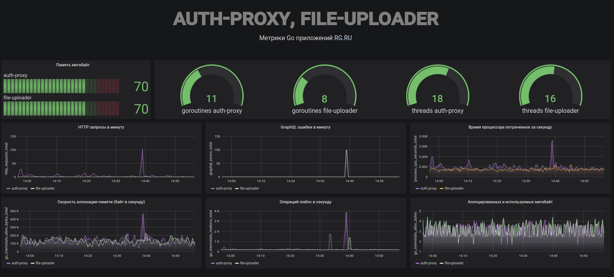
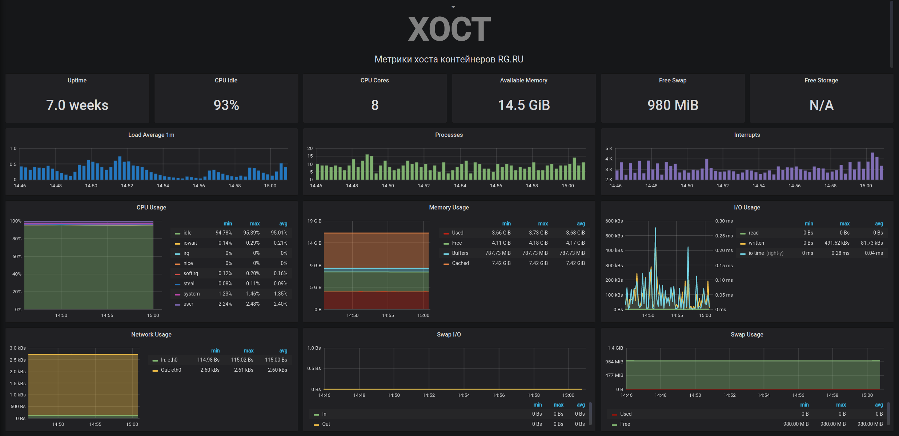
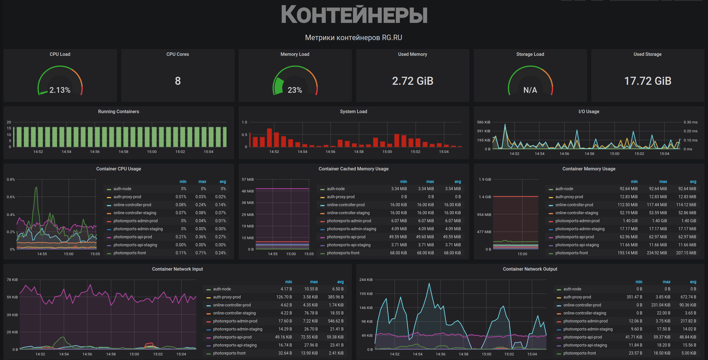
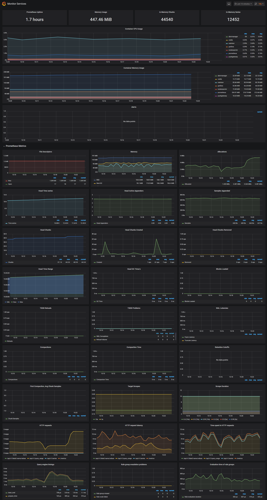

# monitor


## Мониторинг состояния хостов,  контейнеров и приложений.


Решение для мониторинга хостов, контейнеров 
[Docker](https://www.docker.com/)и  приложений [Go](https://golang.org/)
с помощью [Prometheus](https://prometheus.io/), 
[Grafana](http://grafana.org/), 
[cAdvisor](https://github.com/google/cadvisor),
[NodeExporter](https://github.com/prometheus/node_exporter) 
и оповещение с помощью 
[AlertManager](https://github.com/prometheus/alertmanager).


Контейнеры:
----

* Prometheus (метрическая база данных) `http://<host-ip>:9090`
* Prometheus-Pushgateway (push acceptor for ephemeral and batch jobs) `http://<host-ip>:9091`
* AlertManager (управление оповещениями) `http://<host-ip>:9093`
* Grafana (визуализация метрик) `http://<host-ip>:3000`
* NodeExporter (сборщик метрик хоста)
* cAdvisor (сборщик метрик контейнеров)
* Caddy (реверс прокси и базовая аутентификация для Prometheus и AlertManager)

<br>


Настройка Grafana
---------

Перейдите к `http://<host-ip>:3000` и ​​войдите под именем пользователя **admin** пароль **admin**. Вы можете изменить учетные данные в файле compose или указав переменные окружения `ADMIN_USER` и` ADMIN_PASSWORD`  в конфигурационном файле 

```
grafana:
    ...
    environment:
        - GF_SECURITY_ADMIN_USER=${ADMIN_USER:-admin}
        - GF_SECURITY_ADMIN_PASSWORD=${ADMIN_PASSWORD:-admin}
        - GF_USERS_ALLOW_SIGN_UP=false
    ...

```

Панель Сервисов RG
-----------------

Панель позволяет выбрать размещенные приложения и 
отображать их метрики по оотдельности или одновременно.
На панели показаны:

- Тотальная память потребляемая приложением
- Количество горутин и потоков приложения
- Количество HTTP запросов к приложению
- Количество GraphQL ошибок в минуту
- Время процессора потраченное приложением в минуту (нагрузка)
- Скорость аллокации памяти (байт в секунду)
- Количество операций malloc в секунду
- Тотальное количество аллоцированной памяти в данный момент.



Изначально на  панели показана небольшая часть метрик
полный набор которых перечислен в файле 
[go-application-metrics.sh](go-application-metrics.sh). 
Чтобы метрики стали доступны для мониторинга
в приложение необходимо добавить одну из 
[клиентских библиотек Prometheus](https://prometheus.io/docs/instrumenting/clientlibs/). 
Для приложений на Go можно применить https://github.com/prometheus/client_golang.


Панель хоста (Docker Host)
----

На панели  отображены ключевые метрики для мониторинга использования ресурсов вашего сервера.


- Время работоспособности сервера, процент простоя ЦПУ, количество ядер ЦПУ, доступная память, swap и хранилище.
- График средней нагрузки системы, график выполненных и заблокированных IO-процессов, график прерываний.
- График использования ЦПУ в режимах guest, idle, iowait, irq, nice, softirq, steal, system, user.
- График использования памяти по распределению (использовано, свободно, буферы, кэшировано).
- График использования IO (read Bps, read Bps and IO time).
- График использования сети устройствами (входящий Bps, исходящий Bps).
- Использование Swap и графики активности.




Панель контейнеров (Docker Containers)
-------

Панель управления контейнеров докера отображает ключевые метрики для мониторинга используемых контейнеров.


- Общая нагрузка контейнеров ЦПУ, использование памяти и хранилища.
- График используемых контейнеров, график нагрузки системы, график использования IO.
- График использования контейнера ЦПУ.
- График использования памяти контейнера.
- График использования кэшированной памяти.
- График входящего использования сети контейнеров.
- График исходящего использования сети контейнеров.

На панели не представлены контейнеры, являющиеся частью стека мониторинга.





Панель монитора сервисов Prometheus
-------

- Время работы Prometheus, мониторинг общего использования памяти, и локального хранилища Prometheus
- График использования ЦП контейнера
- График использования памяти контейнера
- Prometheus chunks to persist and persistence urgency graphs
- Prometheus chunks ops and checkpoint duration graphs
- Prometheus samples ingested rate, target scrapes and scrape duration graphs
- График HTTP-запросов Prometheus
- График предупреждений Prometheus




Уведомления
--------

Установлено три файла конфигурации уведомлений:


- Уведомления сервисов мониторинга targets.rules;
- Уведомления хоста докера hosts.rules;
- Уведомления контейнеров докера containers.rules.

Вы можете изменять правила уведомления и перезагружать их с помощью запроса HTTP POST:

```
curl -X POST http://<host-ip>:9090/-/reload
````


Настройка уведомлений
------

Сервис AlertManager отвечает за передачу уведомлений сервера Prometheus. 
AlertManager может посылать уведомления с помощью электронной почты, 
Pushover, Slack, HipChat и других систем, использующих интерфейс webhook.

Здесь вы можете просмотреть или выключить уведомления: http://<host-ip>:9093.

Получение уведомлений можно настроить в файле alertmanager/config.yml.

Чтобы получать уведомления через Slack, необходимо настроить интеграцию, выбрав «Исходящие сетевые привязки» на странице приложения.

Скопируйте Slack Webhook URL в поле api_url и определите канал Slack.

```
route:
    receiver: 'slack'

receivers:
    - name: 'slack'
      slack_configs:
          - send_resolved: true
            text: "{{ .CommonAnnotations.description }}"
            username: 'Prometheus'
            channel: '#<channel>'
            api_url: 'https://hooks.slack.com/services/<webhook-id>'
```


-----------------------------

## Для разработчиков

Весь значимый код находится в директории `deploy/`. 
Запуск, останов, пуш, деплой

    sh/up.sh
    sh/down.sh
    sh/push.sh
    sh/deploy.sh

Основано на [dockprom](https://github.com/stefanprodan/dockprom)